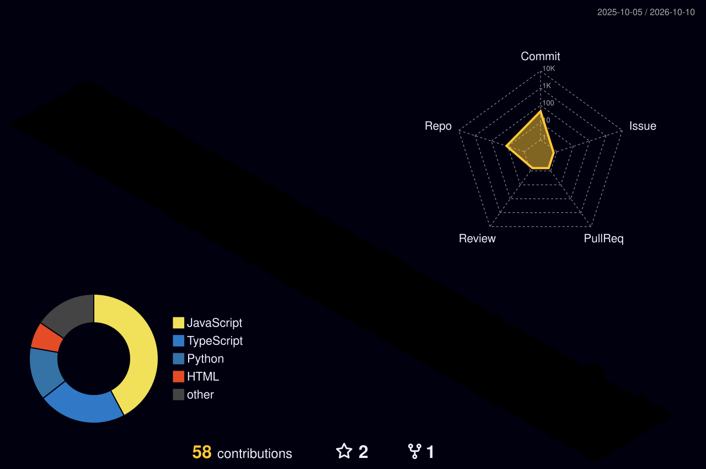

### My Contributions

<picture>
  <source media="(prefers-color-scheme: dark)" srcset="./profile-3d-contrib/profile-night-rainbow.svg" />
  <source media="(prefers-color-scheme: light)" srcset="./profile-3d-contrib/profile-green.svg" />
  
</picture>

[Contribution History](https://github.com/7gautamkumawat7?tab=overview) &nbsp; &bull; &nbsp; [Profile Repository Commits](https://github.com/7gautamkumawat7/7gautamkumawat7/commits)

# Hi, I'm Gautam Kumawat

**Software Engineering Intern &bull; Full-Stack Developer &bull; Backend Developer**

Building thoughtful interfaces and reliable backends with the MERN stack.

**NIT Srinagar &bull; B.Tech, Electrical Engineering &bull; 2024 - 2028**

Srinagar, Jammu & Kashmir, India

---

## About Me

I'm an Electrical Engineering student at **NIT Srinagar** and a full-stack developer specializing in **MongoDB, Express.js, React, and Node.js**. I build web applications that bring responsive interfaces together with structured APIs and database-driven features.

My work includes authentication systems, analytics dashboards, and payment integrations. I care about readable code, maintainable architecture, and a smooth experience for the people using what I build.

## What I Build

| Focus | My Work |
| :--- | :--- |
| **Full-Stack Applications** | Responsive React interfaces connected to Node.js and Express backends |
| **APIs & Authentication** | RESTful APIs, JWT authentication, and database-driven application flows |
| **Dashboards & Data** | Analytics dashboards and Python-based data analysis |
| **Payments & Integrations** | Stripe, PayPal, Razorpay, and Google Maps API integrations |

## Tech Stack

**Languages**

**Frontend**

**Backend & Databases**

**Developer Tools & Data**

**Integrations**

---

### Let's Build Something Useful

Open to collaboration on full-stack applications, backend systems, and developer tools.

[Get in Touch](mailto:7gautamkumawat7@gmail.com) &nbsp; &bull; &nbsp; [Explore My Repositories](https://github.com/7gautamkumawat7?tab=repositories)

