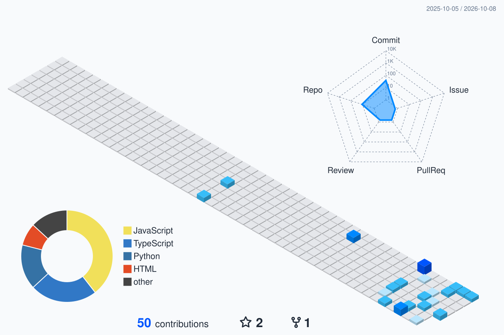

### My Contributions

<picture>
  <source media="(prefers-color-scheme: dark)" srcset="./profile-3d-contrib/profile-blue-dark.svg" />
  <source media="(prefers-color-scheme: light)" srcset="./profile-3d-contrib/profile-blue.svg" />
  
</picture>

[Contribution History](https://github.com/7gautamkumawat7?tab=overview) &nbsp; &bull; &nbsp; [Profile Repository Commits](https://github.com/7gautamkumawat7/7gautamkumawat7/commits)

 

### Building responsive interfaces, reliable APIs, and database-driven web applications.

**NIT Srinagar** &bull; B.Tech, Electrical Engineering &bull; 2024 - 2028  
Srinagar, Jammu & Kashmir, India

---

## About Me

I'm an Electrical Engineering student at **NIT Srinagar** and a full-stack developer focused on the **MERN stack**. I build web applications that combine clean React interfaces, structured Node.js APIs, and database-backed product features.

I enjoy working on authentication systems, analytics dashboards, payment flows, and practical tools that feel fast, reliable, and easy to use.

## What I Build

| Focus | Work |
| :--- | :--- |
| **Full-Stack Apps** | Responsive React applications connected to Node.js and Express backends |
| **APIs & Auth** | REST APIs, JWT authentication, protected routes, and database-driven flows |
| **Dashboards & Data** | Analytics dashboards, charts, and Python-based data analysis |
| **Payments & Integrations** | Stripe, PayPal, Razorpay, Google Maps API, and third-party services |

## Tech Stack

### Languages

### Frontend

### Backend & Databases

### Tools, Data & Integrations

---

### Let's Build Something Useful

Open to collaboration on full-stack applications, backend systems, dashboards, and developer tools.

